# G1 – Projects & Issues

A small CRUD prototype for **projects** and their **issues**, built with plain PHP and PDO,
running in Docker (Nginx + PHP-FPM + MySQL).

Made for **Part G, option G1** of the technical assessment. I also added Docker (option G2)
so the app runs the same way on every computer.

## What is in this repository

| What | Where |
|---|---|
| Written answers (Parts A–F, tasks 20–22) | [docs/Answers.pdf](docs/Answers.pdf) |
| Practical task G1 | this README and the code |
| Self-review | [SELF-REVIEW.md](SELF-REVIEW.md) |
| Screenshots | [screenshots/](screenshots/) |

## Features

- **Projects:** list (with the number of issues), create, edit, delete
- **Issues** inside a project: list, create, edit, delete
- Each issue has a **status** (open / in progress / done) and a **priority** (low / medium / high)
- Issues are sorted: open first, then high priority first
- Server-side validation with an error message next to each field
- Sample data is created automatically on the first start

## Tech stack

- **PHP 8.4** (PHP-FPM), plain PHP with **PDO** – no framework
- **MySQL 8.4** (LTS)
- **Nginx 1.28**
- **Docker** and **Docker Compose**

## How to run it from scratch

### Requirements

- Docker Desktop (Windows / Mac) or Docker Engine with Compose (Linux)
- Git
- Port **8080** must be free

### 1. Clone the repository

```bash
git clone https://github.com/smatsainars/G1.git
cd G1
```

### 2. Create the `.env` file

The database settings live in `.env`. Create it from the template:

```powershell
# Windows (PowerShell)
copy .env.example .env
```

```bash
# Mac / Linux
cp .env.example .env
```

You can change the passwords in `.env` – any values work.

> [!IMPORTANT]
> Never commit `.env` – it contains passwords. It is already in `.gitignore`.

### 3. Start everything

```bash
docker compose up -d --build
```

> [!NOTE]
> The first start takes a few minutes, because Docker downloads PHP, Nginx and MySQL.
> MySQL creates the tables and the sample data automatically.

### 4. Check that it runs

```bash
docker compose ps
```

You should see 3 containers, and `db` should be **(healthy)**.

### 5. Open the app

Go to **http://localhost:8080**

### Useful commands

| Command | What it does |
|---|---|
| `docker compose down` | Stop everything (data is kept) |
| `docker compose down -v` | Stop and **delete the database** – sample data comes back on the next start |
| `docker compose logs app` | Show PHP errors |
| `docker compose restart web` | Reload Nginx after changing its config |

> [!TIP]
> If port 8080 is already used on your computer, change `"8080:80"` to `"8081:80"`
> in `docker-compose.yml` and open http://localhost:8081 instead.

## How it works

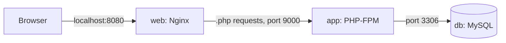

| Service | What it does |
|---|---|
| **web** (Nginx) | Receives the browser requests. Serves only the `public/` folder and sends `.php` requests to `app`. |
| **app** (PHP-FPM) | Runs the PHP code. Built from the `Dockerfile` (official PHP image + `pdo_mysql` + my `php/app.ini`). |
| **db** (MySQL) | Stores the data in the `db_data` volume. Runs `db/init.sql` on the first start. |

Only port **8080** is open to the computer. `app` and `db` can only be reached inside the Docker network.

## Project structure

```text
G1/
├── docker-compose.yml     3 services: web, app, db
├── Dockerfile             PHP-FPM + pdo_mysql + PHP settings
├── .env.example           database settings template (copy to .env)
├── nginx/default.conf     Nginx config: document root = public/
├── php/app.ini            PHP settings: hide errors from users
├── db/init.sql            tables + sample data (SQL schema)
├── src/                   PHP code - NOT reachable from the browser
│   ├── db.php             database connection (PDO)
│   ├── helpers.php        escaping, redirect, flash messages, CSRF
│   ├── validation.php     validation rules for projects and issues
│   └── layout.php         shared page header and footer
├── public/                the only folder the browser can reach
│   ├── index.php          project list
│   ├── project_form.php   create / edit a project
│   ├── project_view.php   one project and its issues
│   ├── project_delete.php
│   ├── issue_form.php     create / edit an issue
│   ├── issue_delete.php
│   └── style.css
└── screenshots/
```

## Database schema

The full SQL is in [`db/init.sql`](db/init.sql).

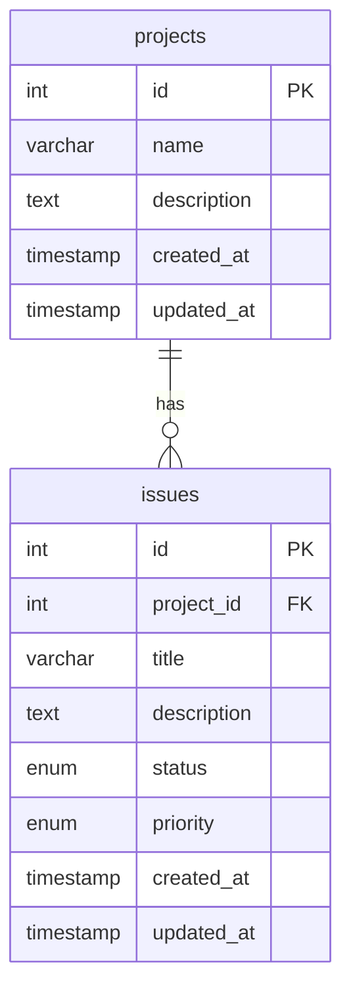

- One project has many issues.
- `issues.project_id` is a **foreign key** with `ON DELETE CASCADE` – deleting a project also deletes its issues.
- `status` and `priority` are `ENUM`s, so the database also refuses wrong values.

## Validation

All checks run **on the server**, whatever the browser sends.

| Field | Rule |
|---|---|
| Project name | required, 3–100 characters |
| Project description | optional, max 1000 characters |
| Issue title | required, 3–150 characters |
| Issue description | optional, max 2000 characters |
| Issue status | must be `open`, `in_progress` or `done` |
| Issue priority | must be `low`, `medium` or `high` |
| `?id=` in the URL | must be a whole number and exist, otherwise 404 |

If something is wrong, the form is shown again with the user's input kept and an error under the field.

## Security

| Risk | What I did |
|---|---|
| SQL injection | Every query uses **PDO prepared statements**. Emulated prepares are turned off. |
| XSS | Everything printed into HTML goes through `htmlspecialchars` (`e()` helper). |
| CSRF | Every form has a random token (`random_bytes`), checked on every POST with `hash_equals`. Wrong token → 403. |
| Wrong input | Server-side validation, allowed values for status and priority. |
| Deleting by link | Delete works only with POST. Opening the URL gives 405. |
| Passwords in Git | Passwords are in `.env`, which is in `.gitignore`. Only `.env.example` is committed. |
| Open database port | MySQL has no `ports:` – it is only reachable inside Docker. |
| App starts before MySQL is ready | `healthcheck` on db + `condition: service_healthy` on app. |
| Code and config downloadable | Nginx serves only `public/`. Hidden files like `.env` are blocked. |
| Error messages leak details | `display_errors` is off. Users see a short message, the full error goes to `docker compose logs app`. |
| Version numbers visible | `server_tokens off` (Nginx) and `expose_php = Off` (PHP). |

> [!NOTE]
> The `docker-compose.yml` from task 20 had some of these risks (passwords in the file,
> open MySQL port, no healthcheck). This setup fixes them.

## Screenshots

### The app

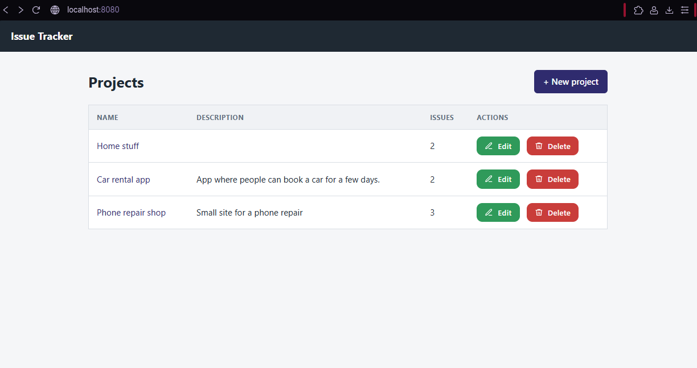

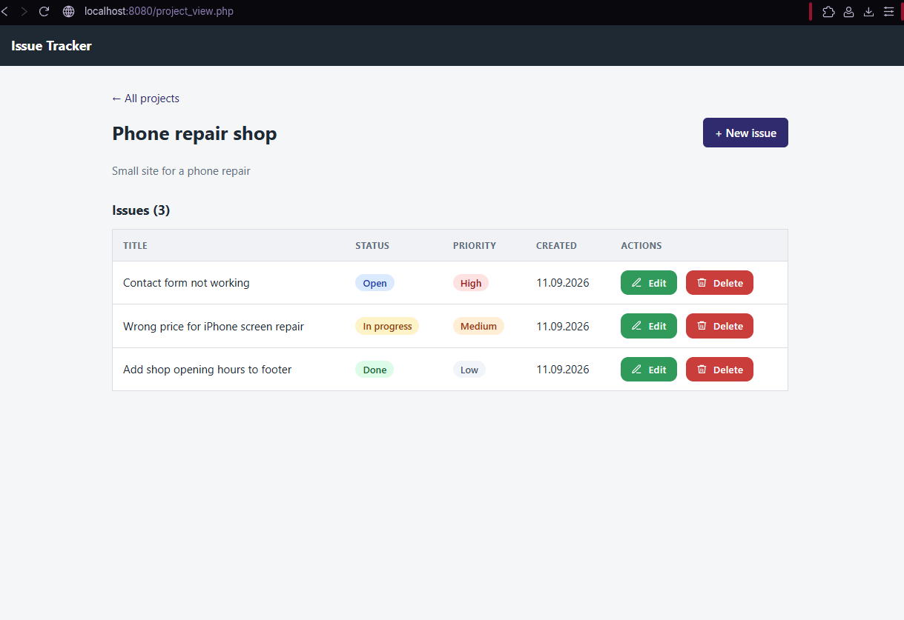

### Docker running

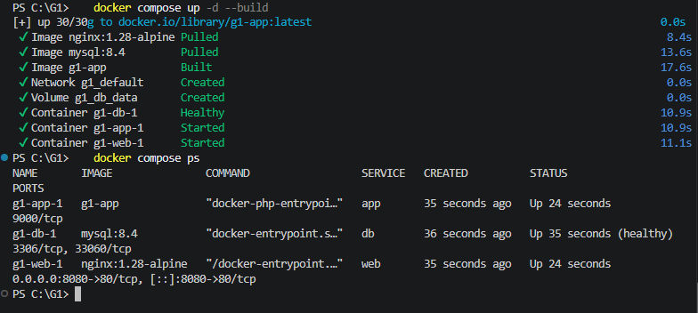

The first test page during setup – PHP connects to MySQL:

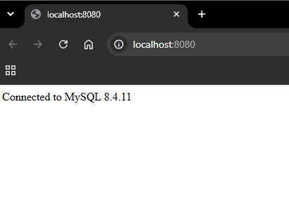

### Validation

Empty name → the server shows an error and saves nothing:

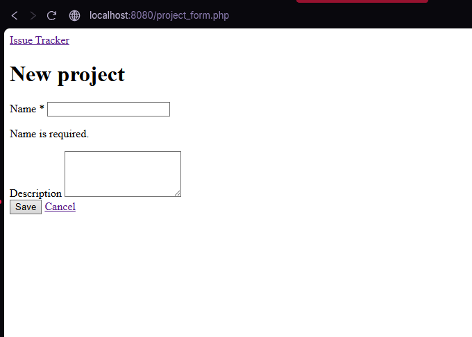

I changed the status to `hacked` in the browser DevTools:

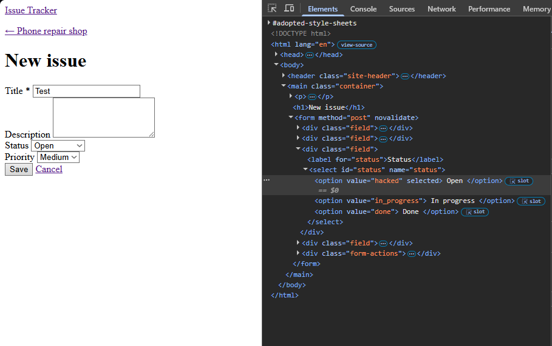

The server rejected it and saved nothing:

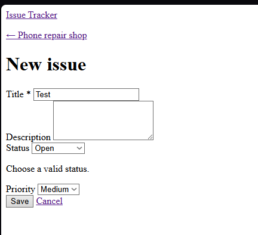

### Security

Only `public/` is reachable – `/src/db.php` gives 404. **Before** the fix, the Nginx version was visible:

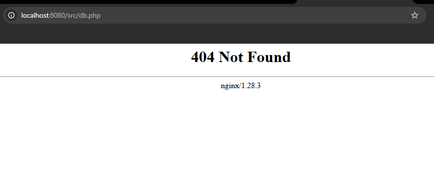

**After** `server_tokens off`, the version is hidden:

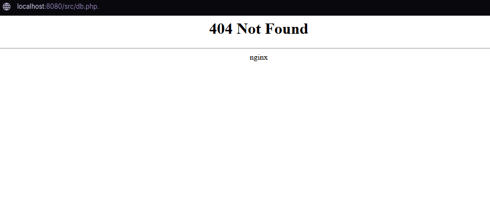

I stopped the database on purpose. The user sees only a short message, and the details are in the logs:

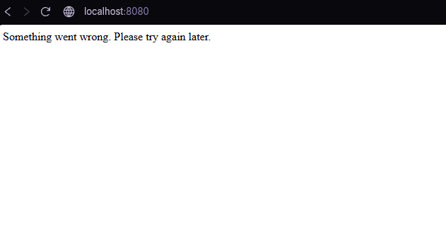

I changed the CSRF token in DevTools. The form was rejected with 403:

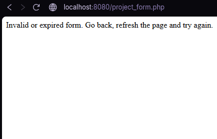

## Git workflow

I used **one branch per feature** and merged each one into `main` with a Pull Request:

| PR | Branch | What |
|---|---|---|
| #1 | `feature/docker-setup` | Docker setup and database schema |
| #2 | `feature/projects-crud` | Projects: list, create, edit, delete |
| #3 | `feature/issues-crud` | Issues: list, create, edit, delete |
| #4 | `feature/security-and-styling` | CSS, CSRF, hidden errors and versions |
| #5 | `docs/readme` | README, self-review, answers |

## Known limitations

No login, no automated tests. More details and next steps are in [SELF-REVIEW.md](SELF-REVIEW.md).